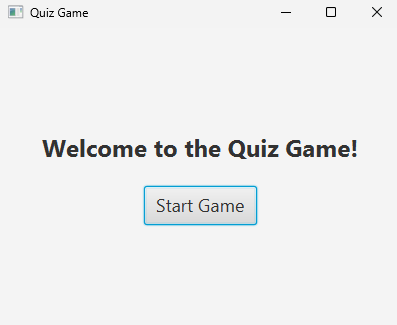
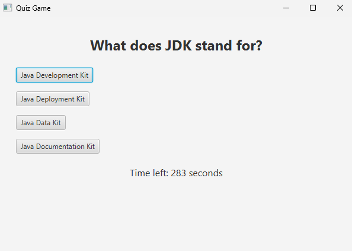

# Java-Quiz
An interactive quiz game developed in Java, showcasing fundamental concepts, JavaFX for the user interface, and Java features such as file I/O and multithreading.

## Features
### Core Functionality
- **Conditionals**: 
   - Game logic uses if/else statements for handling answers and timer logic.
- **Inheritance**: 
   - Demonstrates base (Game) and child (QuizGame, MultipleChoiceQuestion, TrueFalseQuestion) classes.
- **Polymorphism**: 
   - Uses a Game reference to handle instances of QuizGame, and a Question reference for different types of questions. 
- **Exception Handling**: 
   - Gracefully handles invalid input, file I/O issues, and notifies the user.
- **Multithreading**: 
   - Implements a countdown timer using background threads.
### Interactive UI
- Built using JavaFX.
- Presents questions with interactive multiple-choice and true/false options.
- Real-time countdown timer displayed on the UI.
- Score for correct/incorrect answers is shown at the end fo the game.
### File I/O
* Reads questions from a file (questions.txt).
* Saves high scores to a file (highscores.txt).

## Prerequisites
- Maven 3
- JDK 21
- OpenJDK 21

## Setup and Execution
### Clone the Repository

- git clone https://github.com/ShubhSik/Java-Quiz.git
- cd Java-Quiz

### Build the Project

- mvn clean install

### Run the Application

- mvn javafx:run

## File Formats
### Questions File (questions.txt)
- The questions.txt file should follow this format:
  - MC;What is the capital of France?;Paris;Paris,Berlin,Tokyo
  - TF;The Earth is flat.;False 
  - MC: Indicates a multiple-choice question.
  - TF: Indicates a true/false question.
  - High Scores File (highscores.txt)

- The high scores are stored in this file as plain text. Each score is appended after a game session.

## How to Play
- Start the game.
- Questions will appear on the screen with options:
  - For Multiple Choice Questions, click on one of the options. 
  - For True/False Questions, select either "True" or "False."
- You have a limited time to answer each question (tracked by the countdown timer).
- After the game ends, your score is saved to highscores.txt.

  
  

## Testing
### Unit Tests
Unit tests are included for all major classes. Run them with Maven:

- mvn test

### Test Files
- Test questions: questions.txt
- The Suite defines a group of tests to run together: testing.xml

## Future Enhancements
- Add more question types (e.g., fill-in-the-blank).
- Implement a scoring system with bonus points for quick answers.
- Add animations and sound effects.
- Enable multiplayer support and online high-score tracking.
